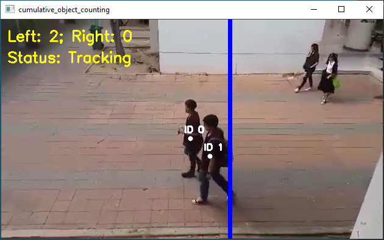
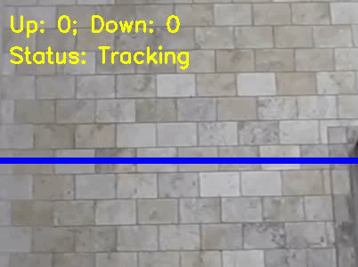
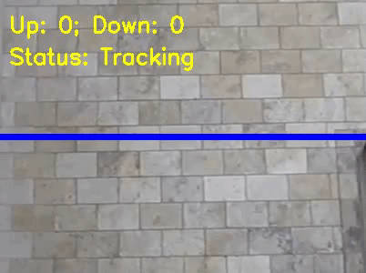

# Mas Saco System
# Using Tensorflow 2 Object Counting

Cummulative object counting with Tensorflow 2 and Tensorflow Lite.



## Installation

1. Clone the repository 
   ```git clone https://github.com/ujangsprr/Mas_Saco_System```

2. [Install the Tensorflow Object Detection API](https://github.com/tensorflow/models/blob/master/research/object_detection/g3doc/tf2.md#installation)

3. Install dependencies
   ```
   cd Mas_Saco_System
   pip3 install -r requirements.txt
   ```

## Cumulative counting with Tensorflow

To run cumulative counting with a Tensorflow object detection model use the [`main.py` script](tensorflow_cumulative_object_counting.py).

```
usage: tensorflow_cumulative_object_counting.py [-h] -m MODEL -l LABELMAP [-v VIDEO_PATH] [-t THRESHOLD] [-roi ROI_POSITION] [-la LABELS [LABELS ...]] [-a] [-s SKIP_FRAMES] [-sh] [-sp SAVE_PATH]

Detect objects inside webcam videostream

optional arguments:
  -h, --help            show this help message and exit
  -m MODEL, --model MODEL
                        Model Path
  -l LABELMAP, --labelmap LABELMAP
                        Path to Labelmap
  -v VIDEO_PATH, --video_path VIDEO_PATH
                        Path to video. If None camera will be used
  -t THRESHOLD, --threshold THRESHOLD
                        Detection threshold
  -roi ROI_POSITION, --roi_position ROI_POSITION
                        ROI Position (0-1)
  -la LABELS [LABELS ...], --labels LABELS [LABELS ...]
                        Label names to detect (default="all-labels")
  -a, --axis            Axis for cumulative counting (default=x axis)
  -s SKIP_FRAMES, --skip_frames SKIP_FRAMES
                        Number of frames to skip between using object detection model
  -sh, --show           Show output
  -sp SAVE_PATH, --save_path SAVE_PATH
                        Path to save the output. If None output won't be saved
```

Example:
    `python main.py -m model_path/saved_model -l labelmap.pbtxt -v video.mp4 -a`

[](https://youtu.be/UN7wRNDjvSg)

## Cumulative counting with Tensorflow Lite

To run cumulative counting with a Tensorflow Lite model use the [`tflite_main.py` script](tflite_main.py).

```
usage: tflite_cumulative_object_counting.py [-h] -m MODEL -l LABELMAP [-v VIDEO_PATH] [-t THRESHOLD] [-roi ROI_POSITION] [-la LABELS [LABELS ...]] [-a] [-e] [-s SKIP_FRAMES] [-sh] [-sp SAVE_PATH] [--type {tensorflow,yolo,yolov3-tiny}]

optional arguments:
  -h, --help            show this help message and exit
  -m MODEL, --model MODEL
                        File path of .tflite file. (default: None)
  -l LABELMAP, --labelmap LABELMAP
                        File path of labels file. (default: None)
  -v VIDEO_PATH, --video_path VIDEO_PATH
                        Path to video. If None camera will be used (default: )
  -t THRESHOLD, --threshold THRESHOLD
                        Detection threshold (default: 0.5)
  -roi ROI_POSITION, --roi_position ROI_POSITION
                        ROI Position (0-1) (default: 0.6)
  -la LABELS [LABELS ...], --labels LABELS [LABELS ...]
                        Label names to detect (default="all-labels") (default: None)
  -a, --axis            Axis for cumulative counting (default=x axis) (default: True)
  -e, --use_edgetpu     Use EdgeTPU (default: False)
  -s SKIP_FRAMES, --skip_frames SKIP_FRAMES
                        Number of frames to skip between using object detection model (default: 20)
  -sh, --show           Show output (default: True)
  -sp SAVE_PATH, --save_path SAVE_PATH
                        Path to save the output. If None output won't be saved (default: )
  --type {tensorflow,yolo,yolov3-tiny}
                        Whether the original model was a Tensorflow or YOLO model (default: tensorflow)
```

Example:
    `python tflite_main.py -m model.tflite -l labelmap.txt -v video.mp4 -a`

[](https://youtu.be/cqyOgifVqZs)

## Inspired by / Based on

This project was inspired by [OpenCV People Counter](https://www.pyimagesearch.com/2018/08/13/opencv-people-counter/) and the [tensorflow_object_counting_api](https://github.com/ahmetozlu/tensorflow_object_counting_api).